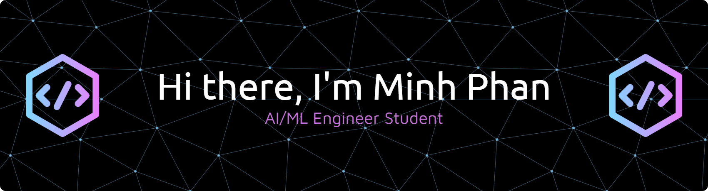

### AI/ML Engineer | Finance & Business Analytics Background

I am a Master of IT student specializing in **Applied AI** at Macquarie University, with a unique background in **Corporate Finance**. I bridge the gap between technical complexity and business value by building intelligent systems that solve real-world problems.

---

### 🧐 Who am I?
* 🎓 **Current:** Pursuing a Master of Information Technology in Applied AI.
* 💼 **Background:** Bachelor of Commerce in Finance & Business Analytics.
* 🚀 **Passion:** I am an AI/ML Engineer passionate about engineering intelligent systems using **RAG pipelines**, **multimodal LLMs**, and **Agentic AI**.
* 🧠 **Focus:** I leverage my financial acumen to ensure technical solutions align with strategic business goals, specializing in process automation and predictive analytics.

---

### 🔭 What I'm Currently Working On
* Developing **Multimodal AI Agents** capable of processing unstructured text and image data for complex information retrieval.
* Refining **RAG (Retrieval-Augmented Generation)** pipelines using ChromaDB and local LLMs to improve data privacy and accuracy.
* Exploring the intersection of **Agentic AI** and financial modeling to automate investment research workflows.

---

### 🛠️ Skills

**Programming Languages:**

**Deep Learning & AI Frameworks:**

**Data Science & Analysis:**

**Tools & Deployment:**

---

### 📫 How to Reach Me

* **LinkedIn:** [linkedin.com/in/minhphan66](https://www.linkedin.com/in/minhphan66/)
* **Email:** [tmphan66@gmail.com](mailto:tmphan66@gmail.com)

---

  <i>"Translating data into value through Financial Intelligence and Applied AI."</i>

