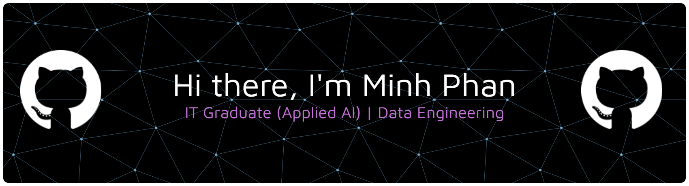

### Data & Analytics Engineer | Applied AI & Finance Background

I am an IT graduate specializing in **Applied AI** and **Data Engineering** with a foundational background in **Corporate Finance**. I bridge the gap between complex data infrastructure and business strategy by building scalable data pipelines, lakehouse architectures, and cloud-native workflows on AWS and Databricks.

---

### 🧐 Who am I?
* 🎓 **Education:** MIT (Applied AI) & BCom (Finance & Business Analytics) from Macquarie University.
* 💼 **Experience:** Former Data Science Intern at **Truuth**, maintaining AWS S3/Lambda ingestion pipelines and optimizing R&D data workflows.
* 🚀 **Passion:** Designing resilient ETL/ELT pipelines, implementing Medallion Architectures, and integrating Generative AI/RAG into production data workflows[cite: 2].
* 🧠 **Focus:** Combining business acumen with modern data stack engineering (Databricks, PySpark, SQL, dbt, Power BI) to drive reliable data processing and analytics[cite: 2].

---

### 🔭 What I'm Currently Working On
* ⚡ **Data Ingestion & Pipelines:** Building scalable ETL/ELT pipelines using **PySpark** and **AWS/Azure**[cite: 2].
* 🧱 **Lakehouse Architecture:** Implementing Medallion Architectures and analytics modeling using **Databricks**, **SQL**, and **dbt**[cite: 2].
* 🤖 **AI-Driven Data Systems:** Developing context-aware RAG workflows and optimizing LLM evaluation frameworks on AWS Bedrock[cite: 2].

---

### 🛠️ Technical Skills

**Languages & Data Engineering:**

**Cloud & Infrastructure:**
-232F3E?style=for-the-badge&logo=amazon-aws&logoColor=white)

**Analytics, BI & ML:**

---

### 🏆 Key Honors & Certifications
* 🥇 **1st Place Winner:** MQ Cybersecurity Hub x Apate.ai Hackathon 2025[cite: 2].
* 🏅 **Multi-Unit Highest Achiever:** COMP8450 (Deep Learning), COMP8460 (AI for NLP), COMP6150 (Database Design), BUSA3020 (Advanced Analytics)[cite: 2].
* 📜 **Databricks Certified:** Databricks Fundamentals, AI Agent Fundamentals, Generative AI Fundamentals[cite: 2].
* 📜 **HackerRank:** SQL (Advanced)[cite: 2].

---

### 📫 How to Reach Me

* 💼 **LinkedIn:** [linkedin.com/in/minhphan66](https://www.linkedin.com/in/minhphan66/)[cite: 2]
* 📧 **Email:** [tmphan66@gmail.com](mailto:tmphan66@gmail.com)[cite: 2]

---

  <i>"Building robust data pipelines and analytics solutions through Data Engineering and Applied AI."</i>

